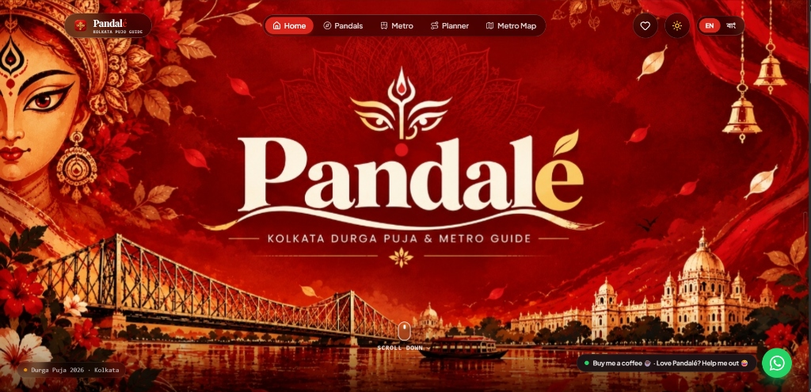

# 🔱 Pandalé • Kolkata Durga Puja & Metro Guide 2026

A modern, high-performance web application recreating the **Pandalé** Kolkata Durga Puja & Metro Guide experience.



---

## ✨ Features Included

1. **Festive Durga Hero**:
   - High-resolution Durga artwork with Howrah Bridge & Victoria Memorial silhouettes
   - Elegant Bengali/Devanagari serif typography
   - Instant search bar with auto-filtering for pandals & metro stations
   - Quick filters for popular pandals (Sree Bhumi, Tala Prattay, College Square, etc.)

2. **Verified Pandals Directory**:
   - 20+ prominent Kolkata Durga Puja pandals (Deshopriyo Park, Santosh Mitra Square, Tala Prattay, College Square, Badamtala Ashar Sangha, Singhi Park, Sovabazar Rajbari, etc.)
   - Category and zone tags (North, South, Central, Salt Lake & East)
   - Live metro proximity cards with blue **M** icon, walking duration & exact distance (e.g. `Kalighat Metro • 11m (900m)`)
   - Heat meters (`🔥 🔥 🔥`) and crowd status indicators (`Heavy Crowd`, `Moderate`)
   - Interactive modal popup with 2026 theme story, Aarti & Anjali timings, best time to visit, nearby street food joints (Paramount, Golbari, Campari), and Google Maps routing

3. **Metro Corridor Guide**:
   - Complete corridor breakdown: Blue Line, Green Line (underwater Hooghly river tunnel), Purple Line, Orange Line
   - Station-by-station accordion view showing pandals within 5-15 mins walking distance
   - Puja midnight timetable information and Tourist Smart Card tips

4. **Interactive Durga Puja Parikrama Route Planner**:
   - Customize by festive day (Maha Sasthi, Saptami, Maha Ashtami, Maha Nabami, Bijoya Dashami)
   - Select starting metro hub and target zone
   - Generates an optimal sequential itinerary with time slots, metro hops, and food stops
   - One-click copy and share to WhatsApp!

5. **Schematic Metro Map**:
   - Color-coded interactive SVG route map of Kolkata Metro
   - Clickable station nodes that spotlight nearby pandals

6. **Bilingual & Festive Theme Support**:
   - Instant toggle between English (`EN`) and Bengali (`বাং` - বাংলা)
   - Midnight Puja Dark Mode & Festive Light Mode

7. **PWA & Social Sharing**:
   - "Add Pandale to Home Screen" installation toast banner
   - Floating "Buy me a coffee ☕" with live pulse dot & WhatsApp quick-share button

---

## 🚀 How to Run in VS Code

### Step 1: Open in VS Code
Open your terminal / command prompt and run:
```bash
code C:\Users\vivek\.gemini\antigravity\scratch\pandale-kolkata-pujo
```
Or open VS Code, click **File ➔ Open Folder...** and choose:
`C:\Users\vivek\.gemini\antigravity\scratch\pandale-kolkata-pujo`

### Step 2: Start Development Server
In the VS Code integrated terminal (`Ctrl + ~`), run:
```bash
npm run dev
```

Open the displayed URL in your browser:
👉 **http://localhost:5173**

### Step 3: Production Build
```bash
npm run build
npm run preview
```
